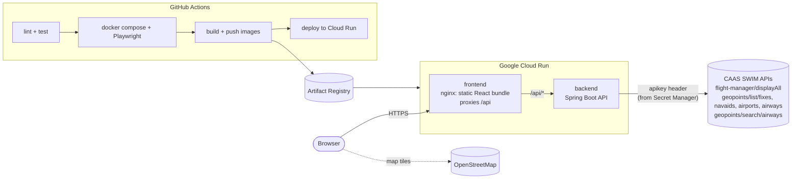

# Flight Plan Viewer

This is the first iteration of the CAAS tech challenge. It lists the flight plans from the CAAS SWIM APIs, lets you search them by callsign, and draws the selected flight's filed route (waypoints and airways) on a world map. An **alternate route** button proposes a different route between the same two airports.

| | |
|---|---|
| **Backend** | Java 21 with Spring Boot 3 (Maven). Calls the CAAS APIs, keeps the API key on the server, caches data and resolves routes to coordinates |
| **Frontend** | React with Vite. Leaflet and OpenStreetMap draw the map |
| **Tests** | JUnit 5, AssertJ and MockMvc for the backend (JaCoCo coverage), Vitest and Testing Library for the frontend, Playwright end to end |
| **Delivery** | Docker multi-stage images, GitHub Actions, Artifact Registry and Google Cloud Run |

## Components



The browser only ever talks to the frontend container. nginx forwards `/api/*` to the backend, so the app needs no CORS setup, the backend URL is set at deploy time, and the CAAS key never reaches the browser.

### Backend (`backend/`)

| Endpoint | What it does |
|---|---|
| `GET /api/flights?callsign=SIA` | Lists flight plans sorted by callsign. Search is a case-insensitive substring match |
| `GET /api/flights/:id/route` | Returns the filed route resolved to coordinates, plus any designators that couldn't be located |
| `GET /api/flights/:id/alternate-route` | Returns an alternate route that avoids every filed waypoint (404 if none exists) |
| `GET /api/airways?q=A46` | Lists all airway (air route) names, optionally filtered |
| `GET /api/airways/{name}` | Returns one airway: its fixes in order and their coordinates |
| `GET /api/health` | Health check that also says where the data comes from: `caas`, `fixtures`, or `fixtures (CAAS unreachable)` |
| `GET /api/docs` | Swagger UI |

Key pieces:

All code is under `src/main/java/com/flightplan/`.

- `caas/CaasClient.java` calls the CAAS APIs with Spring's `RestClient` and the `apikey` header. It keeps an in-memory TTL cache: 60 s for flights and 6 h for the aeronautical data, which is large (about 250k fixes, 10k navaids, 13k airports and 9k airways) and rarely changes. The datasets are downloaded and indexed in the background at startup. **If CAAS is unreachable, or no `CAAS_API_KEY` is set, it serves the bundled `resources/fixtures/`** and retries CAAS every 5 minutes. The UI shows a "Sample data" badge whenever fixtures are being served. Settings are bound from `application.yml` into the `CaasProperties` record.
- `caas/FlightObject.java` holds Java records for the parts of the Flight Object Model that the app reads.
- `geo/GeoPoint.java` parses the aeronautical data format `"WSSL (1.42,103.87)"`. `geo/LatLon.java` computes great-circle distances.
- `airways/AeroData.java` builds the point index from the fixes, navaids and airports lists, and looks airways up by name. The airways list only has names; an airway's fixes come from `/geopoints/search/airways/{name}` as `"A464: [CMA,TOPAS,...]"`, parsed by `route/Airway.java`.
- `route/GeoIndex.java`: **point names are not unique worldwide** (over 12,000 fix names repeat, and KAT is a navaid in Nigeria, Australia and Sri Lanka). Each name maps to all its candidates, and the resolver picks the one nearest the previous point on the route.
- `route/RouteResolver.java` builds the route in order: departure aerodrome, the `filedRoute.routeElement`s sorted by `seqNum`, then the destination. Each element names a point and the airway flown to the next element (`M300/N0486F410` carries a speed and level change, which is stripped). The airway's fixes between the two points are inserted, so the drawn line follows the airway instead of cutting straight across. Coordinates in the flight plan (sent as strings, for oceanic waypoints) are used directly.
- `route/RouteGraph.java` builds a graph from the airways used by any current flight plan plus every filed route, then runs **A\*** (great-circle heuristic) from departure to destination while avoiding the filed route's waypoints.

### Frontend (`frontend/`)

The sidebar has a **Flights** tab (callsign search and flight list) and an **Airways** tab, which lists all air routes with a filter and draws an airway with its fixes when you click it. Routes that cross the 180° meridian (trans-Pacific flights) are drawn continuously instead of across the whole map. Selecting a flight draws its route in blue and shows the ICAO-style route string, for example `WSSS VJR A464 ATMAX WMKK`. **Show alternate route** draws the alternative as a dashed orange line.

## Run it locally

You need Docker, or Java 21 with Maven and Node 22 for the development servers.

```bash
# Whole stack in containers at http://localhost:8080 (fixture data unless a key is given)
CAAS_API_KEY=xxxxx docker compose up --build

# Or development servers with hot reload
cd backend  && CAAS_API_KEY=xxxxx mvn spring-boot:run   # http://localhost:8080/api/docs
cd frontend && npm ci && npm run dev                    # http://localhost:5173 (proxies /api to :8080)
```

## Test

```bash
cd backend  && mvn verify                  # unit tests + MockMvc API tests against fixtures; coverage in target/site/jacoco
cd frontend && npm run lint && npm test    # component tests (fetch mocked)
docker compose up -d --build && cd frontend && npx playwright test   # browser e2e against the containers
```

## CI/CD (`.github/workflows/pipeline.yml`)

1. **Backend** (`mvn verify`: compile, tests, coverage) and **Frontend** (`npm ci`, lint, typecheck, unit tests and build) run in parallel on every push and PR.
2. The **End-to-end** job builds both images with `docker compose`, starts them and runs Playwright against them.
3. **Deploy** runs only on `main`, after everything above passes. It authenticates to Google Cloud with Workload Identity Federation (keyless, so no JSON key is stored in GitHub). It then builds both images, tags them with the commit SHA and pushes them to Artifact Registry. Finally it deploys the backend to Cloud Run (the CAAS key comes from Secret Manager), deploys the frontend pointed at the backend's URL, and smoke-tests `/api/health`.

### CAAS API key

Add the key as a GitHub Actions secret named `CAAS_API_KEY` (Settings > Secrets and variables > Actions). Run the **CAAS API probe** workflow to check it works and print samples of the live data. The backend reads `CAAS_BASE_URL` (default `https://api.swimapisg.info`), `CAAS_FLIGHTS_PATH` (default `/flight-manager/displayAll`) and `CAAS_GEO_PATH` (default `/geopoints`). The `http://...:9080` address from the key email doesn't answer from outside CAAS's network; the HTTPS one does.

### One-time Google Cloud setup

```bash
PROJECT_ID=<gcp-project> GITHUB_REPO=SajeevU/flight-plan CAAS_API_KEY=<key> ./infra/setup-gcp.sh
```

The script enables the APIs and creates the Artifact Registry repo, the `caas-api-key` secret, the deployer service account and the Workload Identity pool. It then prints four values (`GCP_PROJECT_ID`, `GCP_REGION`, `GCP_SERVICE_ACCOUNT`, `GCP_WIF_PROVIDER`) to add as GitHub **repository variables**. Until those are set, the deploy job is skipped and CI still runs.

## Assumptions and known gaps

- Picking the nearest candidate for a repeated name is a heuristic. It is right for normal routes, but a route's first point is placed nearest the departure airport, so a flight plan that starts far from its departure could pick the wrong one.
- The fixtures in `backend/src/main/resources/fixtures/` are illustrative (made-up coordinates). Regenerate them with `python3 backend/scripts/generate_fixtures.py`.
- **Cloud Run can't connect to CAAS** (connections from Google Cloud time out, while GitHub's runners get through). So the deploy job runs `backend/scripts/snapshot_caas.sh` on the GitHub runner and builds the real data into the image. The backend still tries CAAS live first and serves that snapshot when it can't connect, and the UI shows an "Offline data" badge with the snapshot date. A static outbound IP for Cloud Run (VPC connector + Cloud NAT) that CAAS allowlists would make the live calls work.
- The fixtures mirror the live formats, including repeated names in other parts of the world, so the tests exercise the nearest-candidate logic.
- The alternate route is only as good as the known network: airways plus routes other flights have filed.

## Taking it to production

- Make the backend internal-only on Cloud Run and use service-to-service auth from the frontend. Add rate limiting.
- Move the cache to Redis or Memorystore so instances share it, and refresh airways and fixes on a schedule instead of on demand.
- Add structured logging, tracing and alerting with Cloud Logging and Monitoring.
- Infrastructure as code with Terraform instead of the bootstrap script. Add a staging environment with promotion to production.
- Add contract tests against the CAAS OpenAPI specs, and generate typed clients from them.
- Add dependency and image scanning (Dependabot, Trivy) to the pipeline.
- Use a better alternate-route model: airway direction and level restrictions, and avoiding airspace rather than just waypoints.
